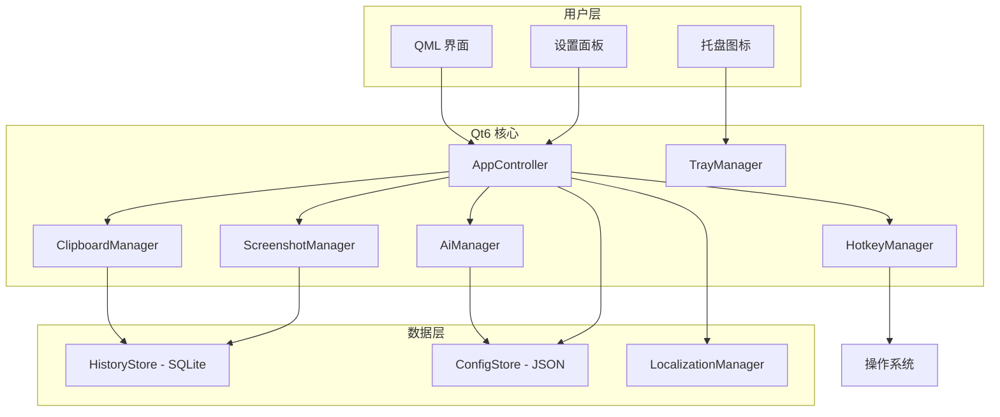
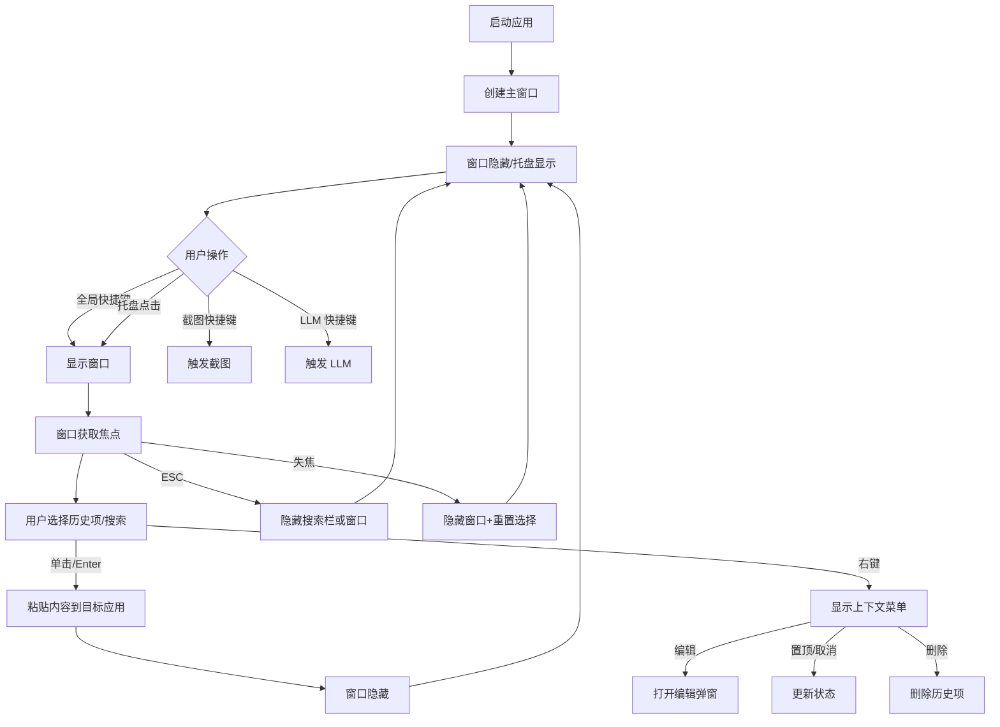
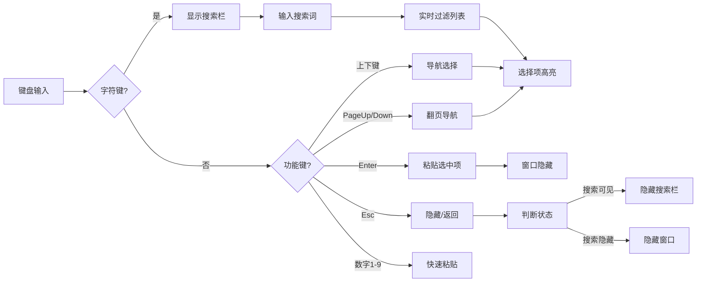

# Clipboard God Qt/QML UI 设计文档

> 基于现有 JavaScript/React 实现迁移到 Qt/QML 的完整产品设计文档

## 目录

1. [产品概述](#产品概述)
2. [整体架构](#整体架构)
3. [主界面设计](#主界面设计)
4. [功能模块详细设计](#功能模块详细设计)
5. [数据模型](#数据模型)
6. [交互设计](#交互设计)
7. [键盘快捷键](#键盘快捷键)
8. [主题系统](#主题系统)
9. [国际化](#国际化)
10. [Qt/C++ 后端实现细节](#qtc-后端实现细节)
11. [迁移建议与状态检查](#迁移建议与状态检查)
12. [文件对照表](#文件对照表)

---

## 产品概述

### 产品定位

Clipboard God 是一款跨平台的剪贴板历史管理工具，支持：
- 文本和图像剪贴板监控
- 快速搜索和过滤（支持全文搜索 FTS5）
- 键盘导航和数字快捷键（1-9 快速粘贴）
- AI/LLM 集成（Ollama、OpenAI 兼容接口）
- 多主题和国际化
- 截图功能（区域选择、标注）
- 置顶功能（重要项永不过期）
- 系统托盘集成

### 目标平台

| 平台 | 状态 | 备注 |
|------|------|------|
| Linux X11 | ✅ 已验证 | 使用 xdotool/maim 方案 |
| Windows | ✅ 兼容 | 全局快捷键、开机自启动 |
| macOS | ✅ 兼容 | 菜单集成、开机自启动 |

---

## 整体架构

### 系统架构图



### 前端架构 (React)

```
src/renderer/
├── App.jsx                    # 主应用组件（状态管理、IPC 监听）
├── components/
│   ├── HistoryList.jsx        # 历史列表容器
│   ├── HistoryItem.jsx        # 单个历史项（右键菜单、工具提示）
│   ├── SearchBar.jsx          # 搜索栏（高级过滤）
│   ├── SettingsModal.jsx      # 设置面板（4 个 Tab）
│   ├── EditModal.jsx          # 编辑弹窗
│   └── ShortcutCapture.jsx    # 快捷键捕获组件
├── hooks/
│   └── useNumberShortcuts.js  # 数字快捷键 Hook
└── locales/                   # 国际化文件
```

### 后端架构 (Node.js/Electron)

```
src/main/
├── mainProcess.js             # 主进程协调器
├── clipboardManager.js        # 剪贴板监控（防重复、批量写入）
├── screenshotManager.js       # 截图功能（electron-screenshots）
├── pasteHandler.js            # 粘贴处理（写入剪贴板+模拟粘贴）
├── config.js                  # 配置管理（JSON 持久化）
├── trayManager.js             # 系统托盘
├── constants/index.js         # 常量定义
├── core/
│   ├── ipcManager.js         # IPC 通信管理
│   ├── errorHandler.js       # 错误处理
│   └── resourceManager.js    # 资源管理（X11 清理）
└── storage/
    └── sqliteStorage.js       # SQLite 存储（FTS5 全文搜索）
```

### Qt/QML 目标架构

```
qt/
├── qml/
│   ├── Main.qml              # 主窗口和根组件
│   ├── components/
│   │   ├── HistoryList.qml   # 历史列表视图
│   │   ├── HistoryItem.qml   # 历史项委托
│   │   ├── SearchBar.qml     # 搜索栏组件
│   │   ├── SettingsModal.qml # 设置弹窗
│   │   ├── EditModal.qml     # 编辑弹窗
│   │   └── ShortcutCapture.qml # 快捷键捕获
│   └── pages/
│       ├── GeneralSettings.qml
│       ├── AppearanceSettings.qml
│       ├── ShortcutsSettings.qml
│       └── LlmSettings.qml
└── src/
    ├── AppController.h/cpp         # 主控制器（协调所有模块）
    ├── HistoryModel.h/cpp          # 历史数据模型（QAbstractListModel）
    ├── HistoryFilterModel.h/cpp    # 过滤模型（QSortFilterProxyModel）
    ├── HistoryStore.h/cpp          # SQLite 存储后端
    ├── ClipboardManager.h/cpp      # 剪贴板监控
    ├── PasteManager.h/cpp          # 粘贴管理
    ├── ScreenshotManager.h/cpp     # 截图管理
    ├── HotkeyManager.h/cpp        # 快捷键管理
    ├── AiManager.h/cpp            # AI 集成
    ├── ConfigStore.h/cpp           # 配置存储
    ├── LocalizationManager.h/cpp   # 国际化
    └── TrayManager.h/cpp          # 托盘管理
```

---

## 主界面设计

### 界面布局

```
┌────────────────────────────────────────────────────────────┐
│  🔍 搜索栏...                                    [⚙️][📷] │
├────────────────────────────────────────────────────────────┤
│  ┌──────────────────────────────────────────────────────┐ │
│  │  [1] 文本预览内容，最多显示 previewLength 个字符...   │ │
│  │        2024-01-01 12:00        📌                    │ │
│  ├──────────────────────────────────────────────────────┤ │
│  │  [2] 📷 缩略图预览                    2024-01-01 11:59│ │
│  │        [查看] [保存]                               📌    │ │
│  ├──────────────────────────────────────────────────────┤ │
│  │  ... 更多历史项 ...                                  │ │
│  │                                                      │ │
│  │  空状态: "暂无剪贴板历史"                            │ │
│  └──────────────────────────────────────────────────────┘ │
├────────────────────────────────────────────────────────────┤
│  📷 截图        📋 粘贴        ⚙️ 设置        🔍 搜索    │
└────────────────────────────────────────────────────────────┘
```

### 窗口尺寸规范

| 属性 | 默认值 | 最小值 | 最大值 | 说明 |
|------|--------|--------|--------|------|
| 宽度 | 400 | 300 | 800 | 主窗口宽度 |
| 高度 | 600 | 400 | 1200 | 主窗口高度 |
| 预览长度 | 120 | 20 | 500 | 可配置 |
| 最大历史数 | 500 | 10 | 100000 | 可配置 |

### Qt/QML 实现参考

```qml
// qml/Main.qml
ApplicationWindow {
    id: window
    visible: true
    width: 400
    height: 600
    minimumWidth: 300
    minimumHeight: 400
    title: qsTr("Clipboard God")
    
    property AppController app: AppController {}
    property string currentTheme: app.config.theme
    property int previewLength: app.config.previewLength
    
    onCurrentThemeChanged: ThemeManager.apply(currentTheme)
    
    Shortcut {
        sequence: StandardKey.Close
        onActivated: window.hide()
    }
    
    ColumnLayout {
        anchors.fill: parent
        spacing: 8
        
        // 顶部工具栏
        RowLayout {
            Layout.fillWidth: true
            
            SearchBar {
                Layout.fillWidth: true
            }
            
            ToolButton {
                icon.source: "qrc:/icons/settings.svg"
                onClicked: settingsPopup.open()
            }
        }
        
        // 历史列表
        HistoryList {
            Layout.fillWidth: true
            Layout.fillHeight: true
        }
        
        // 底部按钮栏
        RowLayout {
            Layout.fillWidth: true
            
            Button {
                text: qsTr("Screenshot")
                icon.source: "qrc:/icons/camera.svg"
                onClicked: app.screenshot()
            }
            
            Button {
                text: qsTr("Paste")
                icon.source: "qrc:/icons/paste.svg"
                onClicked: app.pasteCurrent()
            }
            
            Button {
                text: qsTr("Settings")
                icon.source: "qrc:/icons/settings.svg"
                onClicked: settingsPopup.open()
            }
        }
    }
    
    SettingsPopup {
        id: settingsPopup
    }
}
```

---

## 功能模块详细设计

### 1. 搜索功能

#### 功能描述

- **即时搜索**: 输入字符立即过滤列表（防抖 150ms）
- **高级搜索**: 支持按类型、时间、长度、置顶状态过滤
- **键盘导航**: 上下键选择，Enter 粘贴
- **全文搜索**: 支持 FTS5 全文检索

#### React 实现过滤逻辑

```javascript
// src/renderer/components/SearchBar.jsx
const filteredHistory = useMemo(() => {
    let result = [...history];
    
    // 按类型过滤
    if (searchOptions.type !== 'all') {
        result = result.filter(item => item.type === searchOptions.type);
    }
    
    // 按置顶过滤
    if (searchOptions.pinnedOnly) {
        result = result.filter(item => !!item.pinned);
    }
    
    // 按搜索词过滤
    if (searchTerm) {
        const termLower = searchTerm.toLowerCase();
        result = result.filter(item => 
            item.type === 'text' && 
            item.content.toLowerCase().includes(termLower)
        );
    }
    
    // 排序
    if (searchOptions.sortBy === 'length' && searchTerm) {
        result.sort((a, b) => {
            // 相关性排序：匹配内容短的排在前面
            const aMatch = a.content.toLowerCase().includes(searchTerm.toLowerCase());
            const bMatch = b.content.toLowerCase().includes(searchTerm.toLowerCase());
            if (aMatch && bMatch) {
                return a.content.length - b.content.length;
            } else if (aMatch) return -1;
            else if (bMatch) return 1;
            return 0;
        });
    }
    
    return result;
}, [history, searchTerm, searchOptions]);
```

#### Qt/QML 设计

```qml
// qml/components/SearchBar.qml
TextField {
    id: searchField
    placeholderText: qsTr("Search clipboard history...")
    
    // 防抖处理
    Timer {
        id: debounceTimer
        interval: 150
        onTriggered: app.setSearchFilter(searchField.text, typeFilter.currentIndex, sortBy.currentIndex, pinnedOnly.checked)
    }
    
    onTextChanged: debounceTimer.start()
    
    // 键盘导航：阻止上下键移动光标
    Keys.onUpPressed: { event.accepted = true; app.navigateHistory(-1) }
    Keys.onDownPressed: { event.accepted = true; app.navigateHistory(1) }
    
    // 清除按钮
    ToolButton {
        anchors.right: parent.right
        visible: searchField.text.length > 0
        icon.source: "qrc:/icons/clear.svg"
        onClicked: searchField.text = ""
    }
}

// 高级搜索面板（可折叠）
Column {
    visible: advancedSearchExpanded
    
    ComboBox {
        id: typeFilter
        model: [qsTr("All"), qsTr("Text"), qsTr("Image")]
        currentIndex: 0
        onCurrentIndexChanged: app.setTypeFilter(currentIndex)
    }
    
    ComboBox {
        id: sortBy
        model: [qsTr("By Time"), qsTr("By Length")]
        currentIndex: 0
        onCurrentIndexChanged: app.setSortBy(currentIndex)
    }
    
    CheckBox {
        id: pinnedOnly
        text: qsTr("Pinned Only")
        onCheckedChanged: app.setPinnedOnly(checked)
    }
}
```

#### C++ 后端实现

```cpp
// HistoryFilterModel.h
class HistoryFilterModel : public QSortFilterProxyModel {
    Q_OBJECT
    Q_PROPERTY(QString searchTerm READ searchTerm WRITE setSearchTerm NOTIFY searchTermChanged)
    Q_PROPERTY(int typeFilter READ typeFilter WRITE setTypeFilter NOTIFY typeFilterChanged)
    Q_PROPERTY(bool pinnedOnly READ pinnedOnly WRITE setPinnedOnly NOTIFY pinnedOnlyChanged)
    
public:
    enum ItemType { All = 0, Text = 1, Image = 2 };
    
    bool filterAcceptsRow(int sourceRow, const QModelIndex &sourceParent) const override;
    
signals:
    void searchTermChanged(const QString &term);
    void typeFilterChanged(int type);
    void pinnedOnlyChanged(bool pinnedOnly);
    
private:
    QString m_searchTerm;
    int m_typeFilter = All;
    bool m_pinnedOnly = false;
};

// HistoryFilterModel.cpp
bool HistoryFilterModel::filterAcceptsRow(int sourceRow, const QModelIndex &) const {
    const QAbstractItemModel *model = sourceModel();
    if (!model) return false;
    
    QModelIndex index = model->index(sourceRow, 0);
    QString type = model->data(index, HistoryModel::TypeRole).toString();
    bool pinned = model->data(index, HistoryModel::PinnedRole).toBool();
    QString content = model->data(index, HistoryModel::ContentRole).toString();
    
    // 类型过滤
    if (m_typeFilter == Text && type != "text") return false;
    if (m_typeFilter == Image && type != "image") return false;
    
    // 置顶过滤
    if (m_pinnedOnly && !pinned) return false;
    
    // 搜索词过滤
    if (!m_searchTerm.isEmpty()) {
        if (type == "image") return false; // 图像不支持内容搜索
        if (!content.contains(m_searchTerm, Qt::CaseInsensitive)) return false;
    }
    
    return true;
}
```

### 2. 历史记录列表

#### 功能描述

- 实时显示剪贴板历史
- 支持键盘选择和鼠标悬停
- 单击/Enter 粘贴
- 右键上下文菜单
- 图像预览、查看、保存
- 置顶标记（永不过期）
- 数字快捷键提示（1-9）

#### 历史项数据结构

| 字段 | 类型 | 说明 |
|------|------|------|
| `id` | qint64 | 时间戳 ID |
| `_dbId` | qint64 | 数据库行 ID |
| `type` | QString | `'text'` 或 `'image'` |
| `content` | QString | 文本内容或图像 data URL |
| `timestamp` | QDateTime | 时间戳 |
| `pinned` | bool | 是否置顶 |
| `image_path` | QString | 图像文件路径（可选） |
| `image_thumb` | QString | 缩略图路径（可选） |

#### React 实现 (`HistoryItem.jsx`)

```javascript
// 关键功能：粘贴、上下文菜单、工具提示
const handlePaste = () => {
    window.electronAPI.pasteItem(item);
};

// 右键菜单
const handleContextMenu = (e) => {
    e.preventDefault();
    // 动态创建菜单：编辑、复制、置顶/取消置顶、删除、查看图像、保存图像
};

// 工具提示（使用 rAF 稳定检测）
useEffect(() => {
    if (isSelected && enableTooltips) {
        const checkStable = () => {
            // 等待元素位置稳定 3 帧后显示工具提示
            // 文本：显示完整内容
            // 图像：显示 HTML 格式的预览
        };
        requestAnimationFrame(checkStable);
    }
}, [isSelected]);
```

#### Qt/QML 设计

```qml
// qml/components/HistoryItem.qml
Component {
    id: historyItemDelegate
    
    Rectangle {
        id: itemRect
        width: ListView.view.width
        height: itemColumn.implicitHeight + 16
        
        property bool isSelected: index === ListView.view.currentIndex
        
        color: isSelected ? ThemeManager.selectedBackground : 
               (index % 2 === 0 ? ThemeManager.alternateBackground : ThemeManager.background)
        
        // 悬停效果
        MouseArea {
            anchors.fill: parent
            hoverEnabled: true
            onEntered: itemRect.color = ThemeManager.hoverBackground
            onExited: itemRect.color = isSelected ? ThemeManager.selectedBackground : 
                      (index % 2 === 0 ? ThemeManager.alternateBackground : ThemeManager.background)
            onClicked: app.pasteItem(model.id)
        }
        
        ColumnLayout {
            id: itemColumn
            anchors.fill: parent
            spacing: 8
            
            // 第一行：图标 + 数字快捷键 + 内容预览
            RowLayout {
                spacing: 8
                
                // 类型图标
                Text {
                    text: model.type === "image" ? "📷" : "T"
                    font.pixelSize: 16
                    Layout.preferredWidth: 24
                }
                
                // 数字快捷键
                Text {
                    text: index < 9 ? (index + 1).toString() : ""
                    font.pixelSize: 12
                    color: ThemeManager.shortcutColor
                    visible: app.config.useNumberShortcuts && index < 9
                    Layout.preferredWidth: 16
                }
                
                // 内容预览
                Text {
                    text: {
                        if (model.type === "text") {
                            const full = model.content;
                            return full.length > app.previewLength 
                                ? full.substring(0, app.previewLength) + "..." 
                                : full;
                        } else {
                            return qsTr("Image");
                        }
                    }
                    Layout.fillWidth: true
                    wrapMode: Text.Wrap
                    maximumLineCount: 2
                    elide: Text.ElideRight
                }
                
                // 置顶图标
                Text {
                    text: "📌"
                    visible: model.pinned
                    font.pixelSize: 14
                }
            }
            
            // 第二行：时间戳 + 图像操作按钮
            RowLayout {
                spacing: 8
                
                Text {
                    text: model.timestamp.toLocaleString(Qt.locale(), qsTr("yyyy-MM-dd hh:mm"))
                    font.pixelSize: 11
                    color: ThemeManager.secondaryTextColor
                    Layout.fillWidth: true
                }
                
                // 图像操作按钮（仅图像显示）
                RowLayout {
                    visible: model.type === "image"
                    
                    ToolButton {
                        text: qsTr("View")
                        onClicked: app.viewImage(model.image_path)
                    }
                    
                    ToolButton {
                        text: qsTr("Save")
                        onClicked: app.saveImage(model.image_path)
                    }
                }
            }
        }
        
        // 右键菜单
        Menu {
            id: contextMenu
            
            MenuItem {
                text: qsTr("Edit")
                enabled: model.type === "text"
                onTriggered: editModal.open(model)
            }
            
            MenuItem {
                text: model.pinned ? qsTr("Unpin") : qsTr("Pin")
                onTriggered: app.togglePin(model._dbId, !model.pinned)
            }
            
            MenuSeparator { }
            
            MenuItem {
                text: qsTr("Delete")
                onTriggered: app.deleteItem(model._dbId)
            }
        }
        
        // 右键激活菜单
        Component.onCompleted: {
            itemRect.pressAndHold.connect(() => {
                contextMenu.popup(null, null);
            });
        }
    }
}
```

### 3. 设置面板

#### 功能描述

设置面板分为 4 个 Tab：

| Tab | 图标 | 功能 |
|-----|------|------|
| 通用 | ⚙️ | 语言、预览长度、最大历史数、工具提示、启动选项 |
| 外观 | 🎨 | 主题选择（10 种主题） |
| 快捷键 | ⌨️ | 全局快捷键、截图快捷键 |
| LLM | 🤖 | AI 模型配置（支持多模型） |

#### React 实现 (`SettingsModal.jsx`)

```javascript
// 通用设置
const [settings, setSettings] = useState({
    previewLength: 120,
    maxHistoryItems: 500,
    useNumberShortcuts: true,
    enableTooltips: true,
    launchOnStartup: false,
    locale: 'zh-CN'
});

// LLM 配置结构
llms: {
    "模型名称": {
        apitype: 'ollama' | 'openapi',
        model: 'llama2',
        baseurl: 'http://localhost:11434',
        prompt: 'Summarize {{text}}',
        triggerType: 'text' | 'image',
        temperature: 0.7,
        top_p: 0.95,
        top_k: 0.9,
        llmShortcut: ''
    }
}

// 快捷键冲突检测
const validateShortcuts = () => {
    const shortcutMap = {};
    for (const [name, entry] of Object.entries(llms)) {
        const sc = entry.llmShortcut?.trim().toLowerCase();
        if (sc) {
            if (shortcutMap[sc]) {
                return { conflict: true, shortcuts: [name, ...shortcutMap[sc]] };
            }
            shortcutMap[sc] = name;
        }
    }
    return { conflict: false };
};
```

#### Qt/QML 设计

```qml
// qml/components/SettingsModal.qml
Popup {
    id: settingsPopup
    modal: true
    width: Math.min(window.width - 40, 860)
    height: Math.min(window.height - 40, 620)
    x: (window.width - width) / 2
    y: (window.height - height) / 2
    
    ColumnLayout {
        anchors.fill: parent
        spacing: 0
        
        // 标题栏
        RowLayout {
            Layout.fillWidth: true
            spacing: 8
            
            Text {
                text: qsTr("Settings")
                font.pixelSize: 18
                font.bold: true
            }
            
            Item { Layout.fillWidth: true }
            
            Button {
                text: "✕"
                onClicked: settingsPopup.close()
            }
        }
        
        // Tab 导航
        TabBar {
            id: settingsTabBar
            Layout.fillWidth: true
            
            TabButton {
                text: qsTr("General")
                icon.source: "qrc:/icons/settings.svg"
            }
            TabButton {
                text: qsTr("Appearance")
                icon.source: "qrc:/icons/palette.svg"
            }
            TabButton {
                text: qsTr("Shortcuts")
                icon.source: "qrc:/icons/keyboard.svg"
            }
            TabButton {
                text: qsTr("LLM")
                icon.source: "qrc:/icons/ai.svg"
            }
        }
        
        // Tab 内容
        StackLayout {
            currentIndex: settingsTabBar.currentIndex
            Layout.fillWidth: true
            Layout.fillHeight: true
            
            // Tab 1: 通用设置
            Flickable {
                ColumnLayout {
                    spacing: 16
                    
                    // 语言
                    Label { text: qsTr("Language") }
                    ComboBox {
                        model: ["English", "简体中文"]
                        currentIndex: settings.locale === "zh-CN" ? 1 : 0
                        onCurrentIndexChanged: app.setConfig("locale", 
                            currentIndex === 1 ? "zh-CN" : "en")
                    }
                    
                    // 预览长度
                    Label { text: qsTr("Preview Length") }
                    SpinBox {
                        from: 20
                        to: 500
                        value: settings.previewLength
                        onValueChanged: app.setConfig("previewLength", value)
                    }
                    
                    // 最大历史数
                    Label { text: qsTr("Max History Items") }
                    SpinBox {
                        from: 10
                        to: 100000
                        value: settings.maxHistoryItems
                        onValueChanged: app.setConfig("maxHistoryItems", value)
                    }
                    
                    // 开关设置
                    Switch {
                        text: qsTr("Enable Number Shortcuts")
                        checked: settings.useNumberShortcuts
                        onCheckedChanged: app.setConfig("useNumberShortcuts", checked)
                    }
                    
                    Switch {
                        text: qsTr("Enable Tooltips")
                        checked: settings.enableTooltips
                        onCheckedChanged: app.setConfig("enableTooltips", checked)
                    }
                    
                    Switch {
                        text: qsTr("Launch on Startup")
                        checked: settings.launchOnStartup
                        onCheckedChanged: app.setConfig("launchOnStartup", checked)
                    }
                }
            }
            
            // Tab 2: 外观设置
            Flickable {
                ColumnLayout {
                    Label { text: qsTr("Theme") }
                    Flow {
                        spacing: 8
                        
                        Repeater {
                            model: ["light", "dark", "blue", "purple", "green",
                                    "orange", "pink", "gray", "eye-protection", "high-contrast"]
                            delegate: ThemeCard {
                                themeName: modelData
                                isSelected: settings.theme === modelData
                                onClicked: app.setConfig("theme", modelData)
                            }
                        }
                    }
                }
            }
            
            // Tab 3: 快捷键设置
            Flickable {
                ColumnLayout {
                    Label { text: qsTr("Global Shortcut") }
                    ShortcutCapture {
                        shortcut: settings.globalShortcut
                        onShortcutChanged: app.setConfig("globalShortcut", shortcut)
                    }
                    
                    Label { text: qsTr("Screenshot Shortcut") }
                    ShortcutCapture {
                        shortcut: settings.screenshotShortcut
                        onShortcutChanged: app.setConfig("screenshotShortcut", shortcut)
                    }
                }
            }
            
            // Tab 4: LLM 设置
            Flickable {
                LlmSettingsPanel { }
            }
        }
        
        // 底部按钮
        RowLayout {
            Layout.fillWidth: true
            spacing: 8
            
            Item { Layout.fillWidth: true }
            
            Button {
                text: qsTr("Cancel")
                onClicked: settingsPopup.close()
            }
            
            Button {
                text: qsTr("Save")
                onClicked: app.saveSettings()
            }
        }
    }
}
```

#### 快捷键捕获组件

```qml
// qml/components/ShortcutCapture.qml
RowLayout {
    property string shortcut
    signal shortcutChanged(string newShortcut)
    
    TextField {
        id: shortcutField
        text: parent.shortcut
        readOnly: true
        placeholderText: qsTr("Press any key combination")
    }
    
    Button {
        text: qsTr("Clear")
        onClicked: {
            shortcutField.text = "";
            shortcutChanged("");
        }
    }
    
    // 捕获键盘事件
    Keys.onPressed: {
        event.accepted = true;
        const modifiers = [];
        if (event.modifiers & Qt.ControlModifier) modifiers.push("Ctrl");
        if (event.modifiers & Qt.AltModifier) modifiers.push("Alt");
        if (event.modifiers & Qt.ShiftModifier) modifiers.push("Shift");
        if (event.modifiers & Qt.MetaModifier) modifiers.push("Meta");
        
        const keyText = event.text || event.key.toString();
        if (keyText && !event.key === Qt.Key_unknown) {
            shortcutField.text = modifiers.join("+") + "+" + keyText;
            shortcutChanged(shortcutField.text);
        }
    }
}
```

### 4. 剪贴板监控

#### 功能描述

- 监控文本和图像剪贴板变化
- 自动去重（不重复添加相同内容 hash）
- 支持批量写入数据库（防抖动 120ms）
- 图像压缩存储（SHA256 哈希）
- 置顶项不参与过期删除

#### React 实现 (`clipboardManager.js`)

```javascript
// 防重复和批量写入
class ClipboardManager {
    constructor(options = {}) {
        this.maxHistory = options.maxHistory || 100000;
        this._pendingItems = [];
        this._flushTimer = null;
        this._flushDelayMs = 120;  // 防抖动延迟
        
        // 使用 clipboard.watch API 或定时轮询
        if (clipboard.watch) {
            clipboard.watch((type) => {
                if (type === 'text') this.checkClipboard();
                else if (type === 'image') this.checkClipboard();
            });
        }
    }
    
    // 检查剪贴板并添加新项
    checkClipboard() {
        const formats = clipboard.availableFormats();
        
        if (formats.includes('text/plain')) {
            const text = clipboard.readText();
            const normalized = text.replace(/\r\n/g, '\n').replace(/\r/g, '\n');
            // 防重复：与历史第一条比较
            if (normalized && (!this.history.length || 
                this.history[0].type !== 'text' || 
                this.history[0].content !== normalized)) {
                this.addItem({ type: 'text', content: normalized });
            }
        }
        // 图像处理类似...
    }
    
    // 批量写入
    _flushPendingItems() {
        if (!this._pendingItems.length) return;
        const batch = this._pendingItems.splice(0, this._pendingItems.length);
        
        // 批量写入数据库
        const results = this.storageBackend.addItemsBatch(batch);
        
        // 更新内存中的历史
        for (const result of results) {
            this.history.unshift(result);
        }
        
        // 裁剪：只删除非置顶项
        this._pruneIfNeeded();
        
        this.notifyListeners();
    }
}
```

#### Qt/QML 实现

```cpp
// ClipboardManager.h
class ClipboardManager : public QObject {
    Q_OBJECT
public:
    explicit ClipboardManager(QObject *parent = nullptr);
    void start();
    void stop();
    
signals:
    void historyUpdated(const QVariantList &history);
    void warning(const QString &message);
    
private slots:
    void onClipboardChanged();
    
private:
    void processClipboard();
    void flushPendingItems();
    
    HistoryStore *m_store;
    QClipboard *m_clipboard;
    QTimer *m_flushTimer;
    QList<HistoryItem> m_pendingItems;
    QString m_lastTextHash;
    QString m_lastImageHash;
    bool m_running = false;
};

// ClipboardManager.cpp
ClipboardManager::ClipboardManager(QObject *parent)
    : QObject(parent)
    , m_clipboard(QApplication::clipboard())
    , m_flushTimer(new QTimer(this))
{
    m_flushTimer->setInterval(120);
    connect(m_flushTimer, &QTimer::timeout, this, &ClipboardManager::flushPendingItems);
}

void ClipboardManager::start() {
    if (m_running) return;
    m_running = true;
    
    connect(m_clipboard, &QClipboard::dataChanged,
            this, &ClipboardManager::onClipboardChanged);
}

void ClipboardManager::onClipboardChanged() {
    const QMimeData *mime = m_clipboard->mimeData();
    
    // 检查文本
    if (mime->hasText()) {
        QString text = mime->text();
        QString hash = QString::fromLatin1(QCryptographicHash::hash(
            text.toUtf8(), QCryptographicHash::Sha256).toHex());
        
        if (hash != m_lastTextHash && !text.isEmpty()) {
            m_lastTextHash = hash;
            m_pendingItems.append(HistoryItem("text", text));
            m_flushTimer->start();
        }
    }
    
    // 检查图像
    if (mime->hasImage()) {
        QImage image = qvariant_cast<QImage>(mime->imageData());
        if (!image.isEmpty()) {
            QByteArray bytes;
            QBuffer buffer(&bytes);
            image.save(&buffer, "PNG");
            QString hash = QString::fromLatin1(QCryptographicHash::hash(
                bytes, QCryptographicHash::Sha256).toHex());
            
            if (hash != m_lastImageHash) {
                m_lastImageHash = hash;
                HistoryItem item("image", QString::fromLatin1(bytes.toBase64()));
                item.setImageData(image);  // 存储原始图像数据
                m_pendingItems.append(item);
                m_flushTimer->start();
            }
        }
    }
}

void ClipboardManager::flushPendingItems() {
    if (m_pendingItems.isEmpty()) {
        m_flushTimer->stop();
        return;
    }
    
    QList<HistoryItem> batch;
    batch.reserve(m_pendingItems.size());
    while (!m_pendingItems.isEmpty()) {
        batch.append(m_pendingItems.takeFirst());
    }
    
    // 批量写入数据库
    m_store->addItemsBatch(batch);
    
    // 通知 UI 更新
    emit historyUpdated(m_store->getHistory(m_store->maxHistory(), 0));
}
```

### 5. 快捷键系统

#### 功能描述

| 快捷键 | 功能 | 说明 |
|--------|------|------|
| `CommandOrControl+Alt+V` | 显示/隐藏窗口 | 全局快捷键 |
| `CommandOrControl+Shift+S` | 截图 | 触发截图 |
| `1-9` | 快速粘贴 | 粘贴对应位置的历史项 |
| `↑/↓` | 上下导航 | 历史列表导航 |
| `PageUp/PageDown` | 翻页导航 | 每次 10 项 |
| `Enter` | 粘贴选中项 | 粘贴当前选中项 |
| `Esc` | 隐藏 | 隐藏搜索栏或窗口 |
| `/` | 聚焦搜索 | 聚焦搜索输入框 |
| `Ctrl/Cmd + S` | 保存设置 | 设置面板 |

#### 快捷键验证规则

```javascript
// 快捷键必须包含至少一个修饰键
const validateShortcut = (shortcut) => {
    const modifiers = ['Ctrl', 'Alt', 'Shift', 'Meta', 'CommandOrControl', 'CmdOrCtrl'];
    const upper = shortcut.toUpperCase();
    return modifiers.some(mod => upper.includes(mod));
};
```

#### Qt/QML 实现

```cpp
// HotkeyManager.h
class HotkeyManager : public QObject {
    Q_OBJECT
public:
    explicit HotkeyManager(QObject *parent = nullptr);
    
    bool registerGlobalShortcut(const QString &sequence, const QString &id);
    bool unregisterGlobalShortcut(const QString &id);
    void unregisterAll();
    
signals:
    void toggleRequested();
    void screenshotRequested();
    void llmRequested(const QString &llmKey);
    void warning(const QString &message);
    
private:
#if defined(Q_OS_LINUX) && !defined(Q_OS_MAC)
    // X11: 使用 QHotkey 或 xcb 库
    QHotkey *m_x11Toggle;
    QHotkey *m_x11Screenshot;
#elif defined(Q_OS_WIN)
    // Windows: RegisterHotKey
#elif defined(Q_OS_MAC)
    // macOS: CGEventTap
#endif
    
    QHash<QString, QHotkey*> m_registeredShortcuts;
};

// HotkeyManager.cpp - 平台差异处理
void HotkeyManager::setupPlatformShortcuts() {
#if defined(Q_OS_LINUX) && !defined(Q_OS_MAC)
    // X11: 直接使用 QHotkey
    m_x11Toggle = new QHotkey(QKeySequence("Ctrl+Alt+V"), true, this);
    connect(m_x11Toggle, &QHotkey::activated, this, &HotkeyManager::toggleRequested);
    
    m_x11Screenshot = new QHotkey(QKeySequence("Ctrl+Shift+S"), true, this);
    connect(m_x11Screenshot, &QHotkey::activated, this, &HotkeyManager::screenshotRequested);
#elif defined(Q_OS_WIN)
    // Windows: 使用 RegisterHotKey API
    registerWinHotKey(MOD_CONTROL | MOD_ALT, VK_V, "toggle");
#endif
}
```

### 6. AI/LLM 集成

#### 功能描述

- 支持多个 LLM 配置（Ollama、OpenAI 兼容接口）
- 文本触发和图像触发两种模式
- 可配置的提示词模板（支持 `{{text}}` 占位符）
- LLM 专用快捷键
- 高级参数配置

#### LLM 配置项结构

```json
{
  "模型名称": {
    "apitype": "ollama",
    "model": "llama2",
    "baseurl": "http://localhost:11434",
    "apikey": "",
    "prompt": "Summarize {{text}}",
    "triggerType": "text",
    "temperature": 0.7,
    "top_p": 0.95,
    "top_k": 0.9,
    "context_window": 32768,
    "max_tokens": 32768,
    "min_p": 0.05,
    "presence_penalty": 1.1,
    "llmShortcut": "CommandOrControl+Alt+L"
  }
}
```

#### Qt/QML 实现

```cpp
// AiManager.h
class AiManager : public QObject {
    Q_OBJECT
public:
    explicit AiManager(QObject *parent = nullptr);
    void setConfigStore(ConfigStore *store);
    
    // 发送文本提示
    void sendPrompt(const QString &llmKey, const QString &prompt);
    // 发送图像提示（截图模式）
    void sendPromptWithImage(const QString &llmKey, const QString &prompt, 
                             const QImage &image);
    
signals:
    void responseReady(const QString &llmKey, const QString &response);
    void error(const QString &llmKey, const QString &error);
    
private:
    void sendToOllama(const QString &url, const QJsonObject &body);
    void sendToOpenAI(const QString &url, const QString &apiKey, const QJsonObject &body);
    
    ConfigStore *m_configStore;
    QNetworkAccessManager m_network;
};

// AiManager.cpp - Ollama API 实现
void AiManager::sendToOllama(const QString &baseUrl, const QJsonObject &body) {
    QUrl url(baseUrl + "/api/generate");
    QNetworkRequest request(url);
    request.setHeader(QNetworkRequest::ContentTypeHeader, "application/json");
    
    QNetworkReply *reply = m_network.post(request, QJsonDocument(body).toJson());
    
    connect(reply, &QNetworkReply::finished, this, [reply, this]() {
        if (reply->error() != QNetworkReply::NoError) {
            emit error("ollama", reply->errorString());
            reply->deleteLater();
            return;
        }
        
        QJsonObject response = QJsonDocument::fromJson(reply->readAll()).object();
        QString result = response.value("response").toString();
        emit responseReady("ollama", result);
        reply->deleteLater();
    });
}
```

#### LLM 设置面板

```qml
// qml/pages/LlmSettings.qml
ColumnLayout {
    spacing: 16
    
    // 模型列表
    Label { text: qsTr("LLM Models") }
    ListView {
        id: llmList
        model: app.config.llms
        delegate: LlmItemDelegate {
            // 模型名称、快捷键、删除按钮
        }
    }
    
    // 添加新模型
    Button {
        text: qsTr("Add Model")
        onClicked: addLlmDialog.open()
    }
    
    // 模型配置表单
    Frame {
        visible: selectedLlm !== null
        
        ColumnLayout {
            // 模型名称
            TextField {
                text: selectedLlm?.model ?? ""
                onTextChanged: selectedLlm.model = text
            }
            
            // API 类型
            ComboBox {
                model: ["Ollama", "OpenAI Compatible"]
                currentIndex: selectedLlm?.apitype === "openapi" ? 1 : 0
            }
            
            // Base URL
            TextField {
                placeholderText: "http://localhost:11434"
                text: selectedLlm?.baseurl ?? ""
            }
            
            // API Key（密码字段）
            TextField {
                placeholderText: qsTr("API Key")
                echoMode: TextField.Password
                text: selectedLlm?.apikey ?? ""
            }
            
            // 触发类型
            ComboBox {
                model: [qsTr("Text Trigger"), qsTr("Image Trigger")]
            }
            
            // 提示词模板
            TextArea {
                placeholderText: "Summarize {{text}}"
                text: selectedLlm?.prompt ?? ""
            }
            
            // 快捷键
            ShortcutCapture {
                shortcut: selectedLlm?.llmShortcut ?? ""
            }
            
            // 高级参数（可折叠）
            ExpandableSection {
                title: qsTr("Advanced Parameters")
                
                GridLayout {
                    // Temperature, Top P, Top K, Context Window, Max Tokens, Min P, Presence Penalty
                }
            }
        }
    }
}
```

---

## 数据模型

### 历史项 (HistoryItem)

```cpp
// HistoryItem.h
class HistoryItem {
public:
    HistoryItem() : m_id(0), m_dbId(0), m_type("text"), m_pinned(false) {}
    HistoryItem(const QString &type, const QString &content);
    
    qint64 id() const { return m_id; }
    void setId(qint64 id) { m_id = id; }
    
    qint64 dbId() const { return m_dbId; }
    void setDbId(qint64 dbId) { m_dbId = dbId; }
    
    QString type() const { return m_type; }
    void setType(const QString &type) { m_type = type; }
    
    QString content() const { return m_content; }
    void setContent(const QString &content) { m_content = content; }
    
    QDateTime timestamp() const { return m_timestamp; }
    void setTimestamp(const QDateTime &timestamp) { m_timestamp = timestamp; }
    
    bool pinned() const { return m_pinned; }
    void setPinned(bool pinned) { m_pinned = pinned; }
    
    QString imagePath() const { return m_imagePath; }
    void setImagePath(const QString &path) { m_imagePath = path; }
    
    QString imageThumb() const { return m_imageThumb; }
    void setImageThumb(const QString &thumb) { m_imageThumb = thumb; }
    
    // 角色定义
    enum Roles {
        IdRole = Qt::UserRole + 1,
        DbIdRole,
        TypeRole,
        ContentRole,
        TimestampRole,
        PinnedRole,
        ImagePathRole,
        ImageThumbRole
    };
    
private:
    qint64 m_id;
    qint64 m_dbId;
    QString m_type;
    QString m_content;
    QDateTime m_timestamp;
    bool m_pinned;
    QString m_imagePath;
    QString m_imageThumb;
};
```

### 配置 (ConfigStore)

| 字段 | 类型 | 默认值 | 说明 |
|------|------|--------|------|
| `locale` | QString | `'zh-CN'` | 语言设置 |
| `theme` | QString | `'light'` | 主题 |
| `previewLength` | int | `120` | 文本预览长度 |
| `maxHistoryItems` | int | `500` | 最大历史条目 |
| `useNumberShortcuts` | bool | `true` | 启用数字快捷键 |
| `enableTooltips` | bool | `true` | 启用工具提示 |
| `launchOnStartup` | bool | `false` | 开机自启动 |
| `globalShortcut` | QString | `'CommandOrControl+Alt+V'` | 全局快捷键 |
| `screenshotShortcut` | QString | `'CommandOrControl+Shift+S'` | 截图快捷键 |
| `llms` | QJsonObject | `{}` | LLM 配置 |

---

## 交互设计

### 窗口行为流程图



### 键盘导航流程图



### 上下文菜单

```
右键点击历史项时显示：

┌─────────────────────┐
│ 📝 编辑              │  ← 仅文本项可用
├─────────────────────┤
│ 📌 置顶 / 取消置顶   │
├─────────────────────┤
│ 🗑️ 删除              │
├─────────────────────┤
│ 👁️ 查看图像          │  ← 仅图像项可用
│ 💾 保存图像          │  ← 仅图像项可用
└─────────────────────┘
```

---

## 键盘快捷键

### 默认快捷键

| 快捷键 | 功能 | 平台说明 |
|--------|------|----------|
| `CommandOrControl+Alt+V` | 显示/隐藏窗口 | 全局快捷键 |
| `CommandOrControl+Shift+S` | 截图 | 触发截图 |
| `1-9` | 快速粘贴 | 粘贴对应位置的历史项 |
| `↑` | 选择上一项 | 历史列表导航 |
| `↓` | 选择下一项 | 历史列表导航 |
| `PageUp` | 向上翻页 | 每次 10 项 |
| `PageDown` | 向下翻页 | 每次 10 项 |
| `Enter` | 粘贴选中项 | 粘贴当前选中项 |
| `Esc` | 隐藏 | 隐藏搜索栏或窗口 |
| `/` | 聚焦搜索 | 聚焦搜索输入框 |

### LLM 快捷键（可配置）

| 快捷键 | 功能 |
|--------|------|
| `CommandOrControl+Alt+L` | 调用默认 LLM |
| 自定义 | 调用对应模型 |

---

## 主题系统

### 支持的主题

| 主题 ID | 名称 | 使用场景 |
|---------|------|----------|
| `light` | 浅色主题 | 默认白天使用 |
| `dark` | 深色主题 | 夜间使用 |
| `blue` | 蓝色主题 | 护眼 |
| `purple` | 紫色主题 | 个性化 |
| `green` | 绿色主题 | 护眼 |
| `orange` | 橙色主题 | 温暖风格 |
| `pink` | 粉色主题 | 个性化 |
| `gray` | 灰色主题 | 简约风格 |
| `eye-protection` | 护眼主题 | 长时间使用 |
| `high-contrast` | 高对比主题 | 辅助功能 |

### 主题配色方案

```cpp
// ThemeColors.h
struct ThemeColors {
    QString name;
    QColor background;
    QColor alternateBackground;
    QColor selectedBackground;
    QColor hoverBackground;
    QColor text;
    QColor secondaryText;
    QColor border;
    QColor shortcutColor;
    QColor accent;
};

// 主题定义
static const QHash<QString, ThemeColors> THEMES = {
    {"light", {
        .name = "浅色主题",
        .background = "#ffffff",
        .alternateBackground = "#f5f5f5",
        .selectedBackground = "#e3f2fd",
        .hoverBackground = "#f0f0f0",
        .text = "#212121",
        .secondaryText = "#757575",
        .border = "#e0e0e0",
        .shortcutColor = "#2196f3",
        .accent = "#2196f3"
    }},
    {"dark", {
        .name = "深色主题",
        .background = "#2b2b2b",
        .alternateBackground = "#1f1f1f",
        .selectedBackground = "#333333",
        .hoverBackground = "#3a3a3a",
        .text = "#e8eaed",
        .secondaryText = "#9aa0a6",
        .border = "#444444",
        .shortcutColor = "#4fc3f7",
        .accent = "#4fc3f7"
    }},
    {"blue", {
        .name = "蓝色主题",
        .background = "#e3f2fd",
        .alternateBackground = "#bbdefb",
        .selectedBackground = "#90caf9",
        .hoverBackground = "#bbdefb",
        .text = "#0d47a1",
        .secondaryText = "#1976d2",
        .border = "#64b5f6",
        .shortcutColor = "#1565c0",
        .accent = "#1976d2"
    }},
    // ... 其他主题类似
};
```

### Qt/QML 主题应用

```qml
// ThemeManager.qml
QtObject {
    readonly property string currentTheme: app.config.theme
    
    readonly property color background: {
        switch (currentTheme) {
            case "dark": return "#2b2b2b";
            case "blue": return "#e3f2fd";
            // ...
            default: return "#ffffff";
        }
    }
    
    readonly property color selectedBackground: {
        switch (currentTheme) {
            case "dark": return "#333333";
            case "blue": return "#90caf9";
            // ...
            default: return "#e3f2fd";
        }
    }
    
    // ... 其他颜色属性
    
    function apply(themeName) {
        // 动态应用主题
        // 更新所有组件样式
    }
}
```

---

## 国际化

### 支持的语言

| 语言代码 | 语言名称 | 状态 |
|----------|----------|------|
| `en` | English | ✅ 完成 |
| `zh-CN` | 简体中文 | ✅ 完成 |

### 国际化字符串

```json
{
    "app": {
        "title": "Clipboard God"
    },
    "search": {
        "placeholder": "Search clipboard history...",
        "advanced": {
            "typeLabel": "Type",
            "types": {
                "all": "All",
                "text": "Text",
                "image": "Image"
            },
            "sortLabel": "Sort by",
            "sortOptions": {
                "time": "Time",
                "length": "Length"
            },
            "onlyPinned": "Pinned only",
            "apply": "Apply"
        }
    },
    "history": {
        "empty": "No clipboard history yet",
        "edit": "Edit",
        "pin": "Pin",
        "unpin": "Unpin",
        "view": "View",
        "download": "Download",
        "delete": "Delete"
    },
    "settings": {
        "title": "Settings",
        "save": "Save",
        "cancel": "Cancel",
        "close": "Close",
        "tabs": {
            "general": "General",
            "appearance": "Appearance",
            "shortcuts": "Shortcuts",
            "llm": "LLM"
        },
        "general": {
            "locale": {
                "label": "Language",
                "help": "Select application language"
            },
            "previewLength": {
                "label": "Preview Length",
                "help": "Maximum text preview length"
            },
            "maxHistory": {
                "label": "Max History Items",
                "help": "Maximum number of history items"
            }
        }
    }
}
```

### Qt 实现

```cpp
// LocalizationManager.h
class LocalizationManager : public QObject {
    Q_OBJECT
    Q_PROPERTY(QString locale READ locale WRITE setLocale NOTIFY localeChanged)
    Q_PROPERTY(QQmlObjectListModel<Translation> *translations READ translations CONSTANT)
    
public:
    QString translate(const QString &key) const;
    void setLocale(const QString &locale);
    QString locale() const { return m_locale; }
    
signals:
    void localeChanged(const QString &locale);
    
private:
    QString m_locale;
    QHash<QString, QString> m_translations;
};

// 使用 Qt Linguist 或简单的 JSON 翻译
void LocalizationManager::loadTranslations(const QString &locale) {
    QFile file(QString(":/i18n/%1.json").arg(locale));
    if (file.open(QIODevice::ReadOnly)) {
        QJsonDocument doc = QJsonDocument::fromJson(file.readAll());
        m_translations = doc.object().toVariantMap();
        file.close();
    }
}
```

---

## Qt/C++ 后端实现细节

### AppController 协调器

```cpp
// AppController.h
class AppController : public QObject {
    Q_OBJECT
    Q_PROPERTY(HistoryFilterModel *historyModel READ historyModel CONSTANT)
    Q_PROPERTY(ConfigStore *config READ config CONSTANT)
    
public:
    explicit AppController(QObject *parent = nullptr);
    
    Q_INVOKABLE void showWindow();
    Q_INVOKABLE void hideWindow();
    Q_INVOKABLE void screenshot();
    Q_INVOKABLE void pasteCurrent();
    Q_INVOKABLE void pasteItem(qint64 dbId);
    Q_INVOKABLE void deleteItem(qint64 dbId);
    Q_INVOKABLE void togglePin(qint64 dbId, bool pinned);
    Q_INVOKABLE void setSearchFilter(const QString &term, int type, int sortBy, bool pinnedOnly);
    Q_INVOKABLE void navigateHistory(int delta);
    
signals:
    void windowShown();
    void windowHidden();
    
private slots:
    void onHistoryUpdated(const QVariantList &history);
    void onSettingsChanged(const QJsonObject &settings);
    
private:
    HistoryModel *m_historyModel;
    HistoryFilterModel *m_filterModel;
    HistoryStore *m_historyStore;
    ClipboardManager *m_clipboardManager;
    HotkeyManager *m_hotkeyManager;
    ScreenshotManager *m_screenshotManager;
    AiManager *m_aiManager;
    ConfigStore *m_configStore;
    TrayManager *m_trayManager;
};
```

### SQLite 存储实现

```cpp
// HistoryStore.h
class HistoryStore : public QObject {
    Q_OBJECT
public:
    explicit HistoryStore(QObject *parent = nullptr);
    
    bool init();
    bool addItem(const HistoryItem &item);
    bool addItemsBatch(const QList<HistoryItem> &items);
    QVariantList getHistory(int limit, int offset);
    bool updateTextItem(qint64 dbId, const QString &newContent);
    bool setPinned(qint64 dbId, bool pinned);
    bool deleteItem(qint64 dbId);
    
    int maxHistory() const { return m_maxHistory; }
    void setMaxHistory(int max) { m_maxHistory = max; }
    
private:
    void pruneIfNeeded();
    void cleanupOrphanImages();
    
    QSqlDatabase m_database;
    QString m_dbPath;
    QString m_imagesDir;
    int m_maxHistory = 500;
};

// HistoryStore.cpp - 表结构
bool HistoryStore::init() {
    m_database = QSqlDatabase::addDatabase("QSQLITE");
    m_database.setDatabaseName(m_dbPath);
    
    // WAL 模式提升性能
    QSqlQuery query;
    query.exec("PRAGMA journal_mode = WAL;");
    query.exec("PRAGMA synchronous = NORMAL;");
    
    // 创建表
    query.exec(R"(
        CREATE TABLE IF NOT EXISTS history (
            id INTEGER PRIMARY KEY AUTOINCREMENT,
            item_id TEXT,
            type TEXT NOT NULL,
            content TEXT,
            image_path TEXT,
            image_thumb TEXT,
            hash TEXT,
            timestamp INTEGER,
            pinned INTEGER DEFAULT 0
        )
    )");
    
    // 索引
    query.exec("CREATE INDEX IF NOT EXISTS idx_history_timestamp ON history(timestamp DESC);");
    query.exec("CREATE INDEX IF NOT EXISTS idx_history_hash ON history(hash);");
    
    // FTS5 全文搜索
    query.exec(R"(
        CREATE VIRTUAL TABLE IF NOT EXISTS history_fts USING fts5(content, tokenize="unicode61");
    )");
    
    return m_database.isOpen();
}
```

### 托盘管理

```cpp
// TrayManager.h
class TrayManager : public QObject {
    Q_OBJECT
public:
    explicit TrayManager(QObject *parent = nullptr);
    void setMainWindow(QWindow *window);
    void createTray();
    void destroyTray();
    
signals:
    void showWindowRequested();
    void quitRequested();
    
private slots:
    void onTrayActivated(QSystemTrayIcon::ActivationReason reason);
    
private:
    QSystemTrayIcon *m_trayIcon;
    QMenu *m_trayMenu;
    QWindow *m_mainWindow;
};

// TrayManager.cpp
void TrayManager::createTray() {
    m_trayIcon = new QSystemTrayIcon(this);
    m_trayIcon->setIcon(QIcon(":/icons/tray.png"));
    m_trayIcon->setToolTip("Clipboard God");
    
    m_trayMenu = new QMenu();
    m_trayMenu->addAction(QIcon(":/icons/show.png"), qsTr("Show"), 
                         this, &TrayManager::showWindowRequested);
    m_trayMenu->addAction(QIcon(":/icons/screenshot.png"), qsTr("Screenshot"),
                         [](){ /* 触发截图 */ });
    m_trayMenu->addSeparator();
    m_trayMenu->addAction(QIcon(":/icons/quit.png"), qsTr("Quit"),
                         this, &TrayManager::quitRequested);
    
    m_trayIcon->setContextMenu(m_trayMenu);
    m_trayIcon->show();
    
    connect(m_trayIcon, &QSystemTrayIcon::activated,
            this, &TrayManager::onTrayActivated);
}

void TrayManager::onTrayActivated(QSystemTrayIcon::ActivationReason reason) {
    if (reason == QSystemTrayIcon::Trigger || 
        reason == QSystemTrayIcon::DoubleClick) {
        emit showWindowRequested();
    }
}
```

---

## 迁移建议与状态检查

### 功能完成度检查表

| 功能模块 | 优先级 | Electron 实现 | Qt/QML 状态 | 备注 |
|---------|--------|--------------|-------------|------|
| 主窗口显示/隐藏 | P0 | ✅ 完成 | ⚠️ 部分 | 需完善窗口位置记忆 |
| 历史列表 | P0 | ✅ 完成 | ⚠️ 部分 | 需完善分页加载 |
| 搜索过滤 | P0 | ✅ 完成 | ⚠️ 部分 | 需完善 FTS 搜索 |
| 剪贴板监控 | P0 | ✅ 完成 | ⚠️ 部分 | 需完善稳定性与去重 |
| 粘贴功能 | P0 | ✅ 完成 | ⚠️ 部分 | 需完善粘贴模拟 |
| 截图功能 | P1 | ✅ 完成 | ⚠️ 部分 | 区域选择待实现 |
| 设置面板 | P1 | ✅ 完成 | ❌ 未开始 | 需完整迁移 |
| LLM 集成 | P1 | ✅ 完成 | ⚠️ 部分 | 需完善 API 调用 |
| 主题系统 | P2 | ✅ 完成 | ⚠️ 部分 | 需完善 10 种主题 |
| 国际化 | P2 | ✅ 完成 | ⚠️ 部分 | 需完善中文翻译 |
| 托盘图标 | P2 | ✅ 完成 | ⚠️ 部分 | 需完善菜单 |
| 工具提示 | P2 | ✅ 完成 | ❌ 未开始 | 需单独窗口 |
| 开机自启动 | P3 | ✅ 完成 | ⚠️ 部分 | 跨平台差异 |

### 关键迁移任务

1. **剪贴板监控**: 稳定性与性能优化
2. **截图功能**: 实现区域选择和标注
3. **快捷键**: 验证所有平台兼容性
4. **SQLite**: 确保 FTS5 支持
5. **配置迁移**: 从 JSON 迁移到 QSettings

---

## 文件对照表

| JavaScript | Qt/C++ / QML | 说明 |
|------------|--------------|------|
| `App.jsx` | `AppController.cpp` | 主控制器 |
| `HistoryList.jsx` | `HistoryList.qml` | 历史列表视图 |
| `HistoryItem.jsx` | `HistoryItem.qml` | 历史项委托 |
| `SearchBar.jsx` | `SearchBar.qml` | 搜索组件 |
| `SettingsModal.jsx` | `SettingsModal.qml` | 设置面板 |
| `EditModal.jsx` | `EditModal.qml` | 编辑弹窗 |
| `ShortcutCapture.jsx` | `ShortcutCapture.qml` | 快捷键捕获 |
| `clipboardManager.js` | `ClipboardManager.cpp` | 剪贴板监控 |
| `trayManager.js` | `TrayManager.cpp` | 托盘管理 |
| `screenshotManager.js` | `ScreenshotManager.cpp` | 截图功能 |
| `mainProcess.js` | `AppController.cpp` | 主进程协调 |
| `config.js` | `ConfigStore.cpp` | 配置存储 |
| `sqliteStorage.js` | `HistoryStore.cpp` | SQLite 存储 |
| `useNumberShortcuts.js` | `HotkeyManager.cpp` | 数字快捷键 |

---

## 总结

本文档详细描述了 Clipboard God 从 JavaScript/React 迁移到 Qt/QML 的完整 UI 设计和产品逻辑。主要要点：

1. **界面布局**: 保持一致的搜索栏+列表+按钮栏结构
2. **功能完整**: 搜索、过滤、快捷键、截图、AI 集成等
3. **数据模型**: 历史项和配置结构保持兼容
4. **交互体验**: 键盘导航、上下文菜单、工具提示
5. **主题系统**: 支持 10 种主题和国际化
6. **跨平台**: 需要处理各平台快捷键与粘贴差异
7. **后端架构**: 使用 Qt/C++ 实现高性能后端

建议按照文档中的模块划分逐步迁移，并确保每个模块都有完整的测试覆盖。