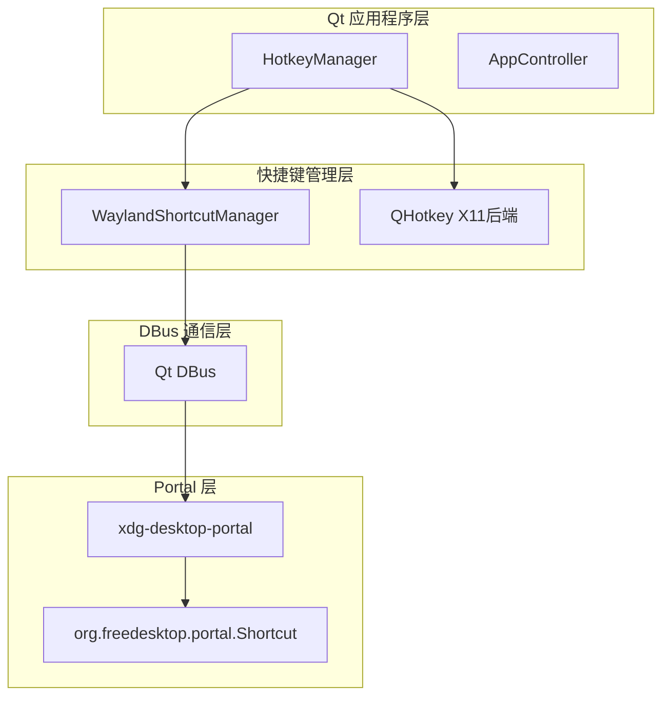
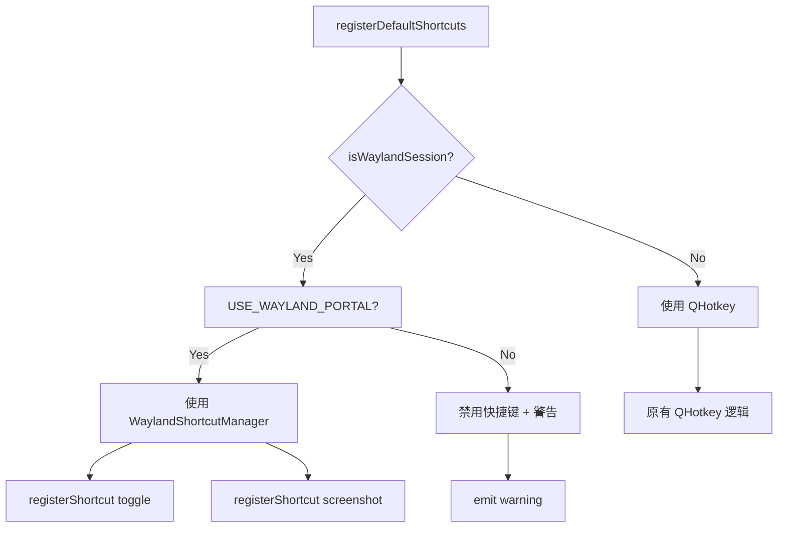
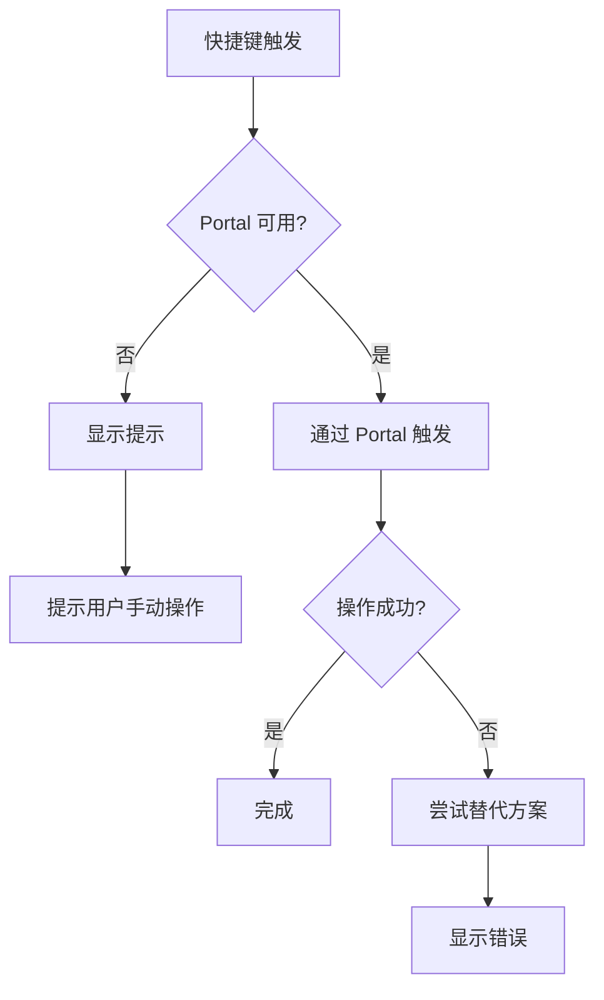

# Wayland 原生快捷键实现设计文档

> 已弃用：Qt 版本已移除 portal/Wayland 快捷键路径，本文件仅供历史参考。

## 概述

本文档描述如何通过 `xdg-desktop-portal` 的 Shortcut 接口实现 Wayland 原生快捷键支持，解决当前 QHotkey 在 Wayland 上被禁用的问题。

## 架构设计

### 组件关系



## WaylandShortcutManager 详细设计

### 类定义

```cpp
// qt/src/WaylandShortcutManager.h
#pragma once

#include <QObject>
#include <QString>
#include <QHash>
#include <QDBusConnection>
#include <QDBusPendingCallWatcher>

class WaylandShortcutManager : public QObject
{
    Q_OBJECT

public:
    explicit WaylandShortcutManager(QObject *parent = nullptr);
    ~WaylandShortcutManager();

    // 初始化：检测 Portal 可用性
    bool init();
    
    // 注册快捷键
    bool registerShortcut(const QString &id, const QString &shortcut);
    
    // 注销快捷键
    bool unregisterShortcut(const QString &id);
    
    // 注销所有快捷键
    void unregisterAll();
    
    // 检查是否可用
    bool isAvailable() const { return m_available; }

signals:
    // 快捷键激活信号（转发给 HotkeyManager）
    void toggleRequested();
    void screenshotRequested();
    void pasteRequested();
    void llmRequested(const QString &llmKey);
    
    // 状态信号
    void availableChanged(bool available);
    void warning(const QString &message);
    void error(const QString &message);

private slots:
    void onShortcutRequested(QDBusPendingCallWatcher *watcher);
    void onPortalResponse(uint response, const QVariantMap &results);
    void onShortcutPressed(const QDBusObjectPath &handle, 
                          uint timestamp,
                          const QString &shortcut,
                          const QVariantMap &options);

private:
    // Portal DBus 常量
    static constexpr const char* PORTAL_BUS_NAME = "org.freedesktop.portal.Desktop";
    static constexpr const char* PORTAL_PATH = "/org/freedesktop/portal/desktop";
    static constexpr const char* PORTAL_INTERFACE = "org.freedesktop.portal.Shortcut";
    
    // 检测 Portal 可用性
    bool checkPortalAvailable();
    
    // 调用 Portal 注册快捷键
    void callRegisterShortcut(const QString &id, const QString &shortcut);
    
    // 解析快捷键字符串为 Portal 格式
    QString parseShortcutToPortalFormat(const QString &shortcut);
    
    // 成员变量
    bool m_available = false;
    QHash<QString, QString> m_shortcutMap;      // id -> shortcut
    QHash<QString, QString> m_registeredShortcuts; // shortcut -> id
    QDBusObjectPath m_currentRequestPath;
    QString m_appId;
};
```

### 快捷键格式转换

QHotkey 使用标准 Qt 格式（如 `Ctrl+Alt+V`），需要转换为 Portal 格式。

| Qt 格式 | Portal 格式 | 示例 |
|---------|-------------|------|
| `Ctrl+V` | `<Primary>v` | `Ctrl+V` → `<Primary>v` |
| `Alt+F4` | `Alt_F4` | `Alt+F4` → `Alt+F4` |
| `Shift+Ctrl+S` | `<Primary><Shift>s` | `Shift+Ctrl+S` → `<Primary><Shift>s` |
| `Super+A` | `Super_a` | `Super+A` → `Super+a` |

### DBus 接口调用

#### RequestShortcuts 方法

```cpp
// 方法调用
QDBusMessage message = QDBusMessage::createMethodCall(
    PORTAL_BUS_NAME,
    PORTAL_PATH,
    PORTAL_INTERFACE,
    "RequestShortcuts");

message << m_appId;                    // sender_handle
message << shortcutName;               // shortcut
message << options;                    // a{sv} options
```

#### ShortcutPressed 信号

```cpp
// 信号处理
void WaylandShortcutManager::onShortcutPressed(
    const QDBusObjectPath &handle,
    uint timestamp,
    const QString &shortcut,
    const QVariantMap &options)
{
    QString id = m_registeredShortcuts.value(shortcut);
    if (id == "toggle") emit toggleRequested();
    else if (id == "screenshot") emit screenshotRequested();
    else if (id == "paste") emit pasteRequested();
    else if (id.startsWith("llm:")) emit llmRequested(id);
}
```

## 与 HotkeyManager 集成

### 集成策略



### 代码示例

```cpp
void HotkeyManager::registerDefaultShortcuts(
    const QString &toggleShortcut,
    const QString &screenshotShortcut)
{
#ifdef USE_QHOTKEY
    if (isWaylandSession())
    {
#ifdef USE_WAYLAND_PORTAL
        if (!m_waylandShortcutManager->isAvailable())
        {
            emit warning("Wayland portal not available, shortcuts disabled");
            return;
        }
        m_waylandShortcutManager->registerShortcut("toggle", toggleShortcut);
        m_waylandShortcutManager->registerShortcut("screenshot", screenshotShortcut);
        return;
#else
        emit warning("Global shortcuts are disabled on Wayland (enable USE_WAYLAND_PORTAL).");
        return;
#endif
    }
    // ... QHotkey 原有逻辑
#endif
}
```

## 错误处理策略

### 错误场景与处理

| 场景 | 处理方式 | 用户提示 |
|------|---------|----------|
| Portal 不可用 | 禁用快捷键 | "Wayland 快捷键不可用，请安装 xdg-desktop-portal" |
| 快捷键冲突 | Portal 自动处理 | Portal 会提示用户选择 |
| DBus 调用失败 | 回退到无快捷键模式 | "快捷键注册失败" |
| 快捷键被占用 | 返回错误 | "快捷键已被其他程序占用" |

### 回退机制



## CMake 配置

```cmake
# qt/CMakeLists.txt 添加

# Wayland Portal 支持（可选）
option(USE_WAYLAND_PORTAL "Use xdg-desktop-portal for shortcuts on Wayland" ON)

if(USE_WAYLAND_PORTAL)
    find_package(Qt6 REQUIRED COMPONENTS DBus)
    target_link_libraries(clipboard-god-qt PRIVATE Qt6::DBus)
    target_compile_definitions(clipboard-god-qt PRIVATE USE_WAYLAND_PORTAL)
endif()
```

## 测试策略

### 单元测试

1. **Portal 可用性检测**
   - 检测 Portal 服务是否运行
   - 检测 DBus 连接

2. **快捷键注册测试**
   - 注册有效的快捷键
   - 验证注册状态
   - 测试重复注册

3. **信号传递测试**
   - 模拟快捷键激活
   - 验证信号正确传递

### 集成测试

1. **实际快捷键测试**
   - 在 Wayland 会话中测试
   - 验证快捷键响应

2. **错误恢复测试**
   - Portal 崩溃后恢复
   - 快捷键重新注册

## 依赖要求

### 运行时依赖

- `xdg-desktop-portal` >= 1.14
- `xdg-desktop-portal-gtk` 或对应的桌面环境实现

### 构建时依赖

- Qt6 DBus 模块
- CMake >= 3.20

## 已知限制

1. **Portal 版本差异**：不同桌面环境的 Portal 实现可能略有差异
2. **快捷键格式**：某些快捷键格式可能不被所有桌面环境支持
3. **焦点要求**：Portal 可能要求应用窗口具有一定焦点才能接收快捷键

## 未来改进

1. **快捷键冲突 UI**：添加快捷键冲突检测和用户提示界面
2. **动态快捷键修改**：支持运行时修改快捷键
3. **多快捷键组合**：支持更复杂的快捷键组合